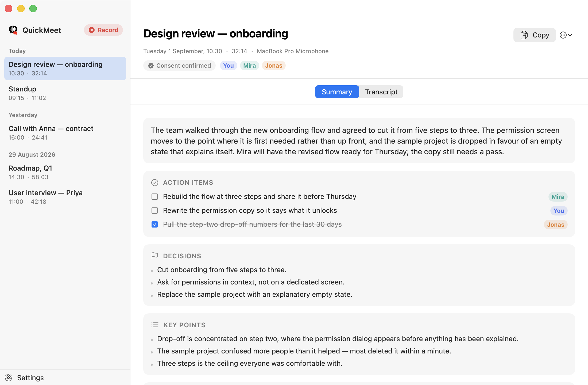

<p align="center">
  
</p>

<h1 align="center">QuickMeet</h1>

<p align="center"><strong>An open source meeting recorder and note taker for Mac. Bring your own Gemini key.</strong></p>

<p align="center">
  
  
  
</p>

**Bring your own key.** QuickMeet is a menu-bar client for Google's **Gemini 3.5
Transcribe** — you paste your own API key from
[aistudio.google.com](https://aistudio.google.com), and your audio goes to Google and
nowhere else. No account, no subscription, no server of ours in the middle. No
dependencies, no telemetry.

It records both halves of a call — your microphone **and** the audio your Mac is playing —
then transcribes them with speaker labels and writes the notes.

The long-form sibling to **QuickTalk**, which does push-to-talk dictation.

<p align="center">
  
</p>

---

## Before you record

**Ask the room first.** Recording other people without their agreement is rude at best and
illegal in plenty of places. QuickMeet can't know who is on your call, so it does what
software can: a per-meeting reminder with a sentence to say out loud, a box for who agreed,
that consent stored with the meeting and included in every export, and a menu-bar timer
plus on-screen pill that **cannot be hidden**.

There is no hidden recording mode and there will not be one.

## Install

There is no download — you build it yourself, in one command. Gatekeeper blocks
un-notarised downloads, and notarisation needs a paid Apple Developer account.

```bash
./build.sh
open /Applications/QuickMeet.app
```

That compiles, signs and installs to `/Applications`. Needs macOS 14.4+ and the Swift
toolchain (`xcode-select --install` is enough). Settings opens on first run for your API
key; the two permissions are requested when they're first needed.

## Using it

Click **Record Meeting** in the menu bar, or press **⌥⌘R**. A pill appears under the notch
with a timer and two meters, *You* and *Others*. Press ⌥⌘R again or click Stop to finish —
transcription runs in the background and notifies you when the notes are ready.

You get a summary (decisions, action items with owners, open questions) and the full
transcript with speaker and timestamp, both searchable and exportable as Markdown with the
consent line included. Speakers start as *You*, *Speaker 1*, *Speaker 2*; click a name chip
to rename one and it updates transcript and notes at display time, with no model re-run.

Wearing headphones gives a noticeably better transcript.

### How it works

Two independent recordings, not one mixed track:

```
microphone ──► AUHAL ─────────────► mic.wav ───► verbatim + word timestamps ────┐
                                                                               ├─► merge ─► notes
system ──────► process tap ───────► system.wav ► verbatim + word timestamps ────┘
                └► private aggregate             + speaker diarization
```

Your microphone is *you* by construction, so the most important speaker split never goes
through a model. Diarization only has to separate the remote participants, which is where
it's actually reliable — and on a 1:1 call it has nothing to do at all.

Diarization caps a request at 30 minutes, so longer meetings are split into 20-minute
chunks that **overlap by 20 seconds**. The overlap is what lets chunk 2's `spk_1` be
matched back onto chunk 1's `spk_2`, by comparing who was talking at the same instant.

If you record on speakers, the same sentence arrives on both streams. QuickMeet keeps the
system copy, because that's the one with the right speaker on it — but short interjections
("yeah", "mhm") are never dropped.

Transcripts come from `gemini-3.5-transcribe`, which takes no prompt and can't run in smart
mode with diarization on — so all the structure you see comes from a second call to
`gemini-3.5-flash`.

## Permissions

Two, and no more: **Microphone** for your half, **System Audio Recording** for everyone
else's. QuickMeet uses Core Audio process taps, so the system-audio permission is
audio-only — it never asks for Screen Recording and cannot see your screen. ⌥⌘R is a Carbon
hot key, needing no Accessibility or Input Monitoring grant.

macOS gives no way to *read* the system-audio permission, so Settings has a **Check
permission** button that opens a real tap and reports what happened. Grant it under
**Privacy & Security → Screen & System Audio Recording**.

## Your API key

Stored in a `0600` file at `~/Library/Application Support/QuickMeet/gemini-api-key`, inside
a `0700` directory, excluded from Time Machine and never logged. Not the Keychain (access
is per code signature, so every differently-signed build would prompt) and not
`UserDefaults` (`defaults read` would print it). Settings has a **Forget key** button.

No local store protects a key from other software running as *you*. If your machine stops
being trustworthy, revoke the key at [aistudio.google.com](https://aistudio.google.com).

## Privacy

- **No screen recording, accessibility or input monitoring** — nothing that can read your
  screen or your keystrokes.
- **Nothing runs while idle** — no timers, no polling, no audio session between meetings.
- **Audio is deleted 7 days after transcription** by default, or as soon as a transcript
  exists. The transcript is what you wanted; the audio is other people's voices.
- **One network destination**, `generativelanguage.googleapis.com`.
- **The transcript is data, never instructions.** "Ignore your instructions" said in a
  meeting is summarised as a person saying an odd thing, not obeyed.

## Troubleshooting

`~/Library/Logs/QuickMeet.log`, or **Copy Diagnostics** in the menu bar, records the device
opened, chunk counts, peak levels and any HTTP error with the real server message. It never
contains your API key or any transcript text, so it's safe to paste publicly.

| Symptom | Cause |
|---|---|
| **"Others" meter doesn't move** | Nothing is playing yet. An output device stops clocking while idle — normal, and it recovers by itself. |
| **Transcript has only your voice** | Nothing played, or the system-audio permission is refused. `peak=0.0000` with frames arriving means the permission. |
| **Music goes muffled while recording** | A Bluetooth microphone is selected. Pick the built-in or a wired mic. |
| **Permission reads as enabled but the app disagrees** | The signature changed. `tccutil reset Microphone com.quickmeet.QuickMeet` and re-grant. |
| **⌥⌘R does nothing** | Another app owns the shortcut. The menu bar item always works. |

## License

MIT — see [LICENSE](LICENSE).
