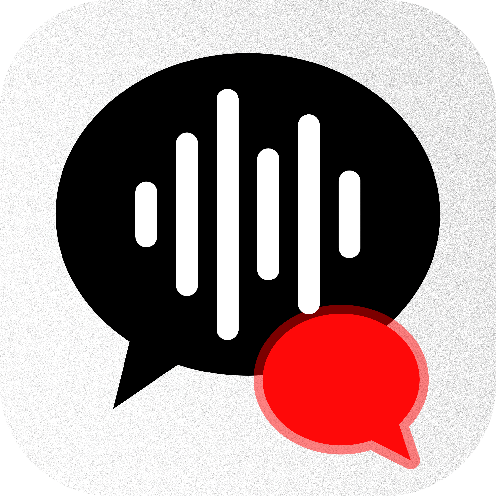

<p align="center">
  
</p>

<h1 align="center">QuickMeet</h1>

<p align="center"><strong>An open source meeting recorder and note taker for Mac, using Gemini 3.5 Transcribe.</strong></p>

<p align="center">
  
  
  
</p>

Records both halves of a call — your microphone **and** the audio your Mac is playing —
then transcribes them with speaker labels and writes the notes. Menu bar only, no Dock
icon, powered by Google's **Gemini 3.5 Transcribe** with your own API key.

No dependencies, no telemetry, no accounts. You bring your own key and Google handles the
rest.

The long-form sibling to **QuickTalk**, which does push-to-talk dictation.

---

## Before you record

Recording other people is not a neutral act, and in much of the world it is a criminal
offence rather than a discourtesy:

- **Germany** — §201 StGB, *Verletzung der Vertraulichkeit des Wortes*. Up to three years,
  and it covers ordinary work calls, not just secret ones.
- **United States** — around a dozen states require all-party consent, including
  California, Florida, Illinois, Massachusetts, Pennsylvania and Washington.
- **Workplaces** — in Germany a tool like this is a *technische Einrichtung* under §87
  BetrVG, so the works council may need to be involved before anyone uses it.
- **GDPR** — record a colleague and you are the controller of their personal data, with
  Google as your processor.

QuickMeet can't know where you are or who is on the call, so it does what software can:

| | |
|---|---|
| **One-time acknowledgement** | Before the first recording, stating the above |
| **Per-meeting reminder** | With a sentence to say out loud, and a box for who agreed |
| **Always-on indicator** | Menu bar timer and on-screen pill, **which cannot be hidden** |
| **Consent on the record** | Stored with the meeting and included in every export |

There is no hidden recording mode and there will not be one. If that's what you're after,
this is the wrong project.

*Not legal advice — just the reasoning behind how the consent screens are built.*

## Install

There is no download — you build it yourself, in one command
([why](#why-theres-no-prebuilt-download)):

```bash
./build.sh
```

That compiles, assembles the `.app`, signs it, and installs it to `/Applications`. Needs
macOS 14.4+ and the Swift toolchain (`xcode-select --install` is enough). Then:

```bash
open /Applications/QuickMeet.app
```

Settings opens on first run. Paste your Gemini API key from
[aistudio.google.com](https://aistudio.google.com) — the two permissions are requested when
they're first needed.

## Using it

Click **Record Meeting** in the menu bar, or press **⌥⌘R**. A pill appears under the notch
with a timer and two meters, *You* and *Others*, and stays there for the whole recording.
Press ⌥⌘R again or click Stop to finish. Transcription runs in the background and notifies
you when the notes are ready.

| | |
|---|---|
| **Summary** | What it was about, decisions, action items with owners, open questions |
| **Transcript** | Every turn with speaker and timestamp, searchable |
| **Export** | Copy or save as Markdown, consent line included |

Wearing headphones gives a noticeably better transcript. Without them your microphone also
hears the call, and both sides land on one track.

### How it works

Two independent recordings, not one mixed track:

```
microphone ──► AUHAL ─────────────► mic.wav ───► verbatim + word timestamps ────┐
                                                                               ├─► merge ─► notes
system ──────► process tap ───────► system.wav ► verbatim + word timestamps ────┘
                └► private aggregate             + speaker diarization
```

Your microphone is *you* by construction, so the most important speaker split never goes
through a model. Diarization only has to separate the remote participants, which is where
it's actually reliable — and on a 1:1 call it has nothing to do at all.

Diarization caps a request at 30 minutes, so longer meetings are split into 20-minute
chunks that **overlap by 20 seconds**. The overlap is what lets chunk 2's `spk_1` be
matched back onto chunk 1's `spk_2`, by comparing who was talking at the same instant.

If you record on speakers, the same sentence arrives on both streams. QuickMeet detects
those duplicates and keeps the system copy, because that's the one with the right speaker
on it — but short interjections ("yeah", "mhm") are never dropped.

### Speakers and names

Speakers start as *You*, *Speaker 1*, *Speaker 2*. Click a name chip to rename one; it
updates the transcript **and** the notes. Names are substituted at display time, so
renaming costs nothing and never re-runs a model.

### Models

| Stage | Model |
|---|---|
| Transcript | `gemini-3.5-transcribe` |
| Summary, headings, action items | `gemini-3.5-flash` |

The transcribe model takes no prompt and, with diarization on, cannot run in smart mode —
so every bit of structure you see comes from the second call.

## Permissions

Two, and no more:

| Permission | What for |
|---|---|
| **Microphone** | Your half of the conversation |
| **System Audio Recording** | Everyone else's half |

QuickMeet uses **Core Audio process taps**, so the system-audio permission is audio-only:
it never asks for Screen Recording and cannot see your screen. The ⌥⌘R shortcut is a Carbon
hot key, which needs no Accessibility or Input Monitoring grant at all.

macOS gives no way to *read* the system-audio permission, so Settings has a **Check
permission** button that opens a real tap and reports what happened. Grant it under
**Privacy & Security → Screen & System Audio Recording**, where QuickMeet appears as
audio-only.

## Troubleshooting

`~/Library/Logs/QuickMeet.log`, or **Copy Diagnostics** in the menu bar, records the device
opened, the aggregate's clock anchor, chunk counts, peak levels and any HTTP error with the
real server message. It never contains your API key or any transcript text.

| Symptom | Cause |
|---|---|
| **"Others" meter doesn't move** | Nothing is playing yet. An output device stops clocking while idle, so no audio arrives until something does — this is normal and recovers by itself. |
| **Transcript has only your voice** | Either nothing played during the meeting, or the system-audio permission is refused. The log says which: `peak=0.0000` with frames arriving means the permission. |
| **Music goes muffled while recording** | A Bluetooth microphone is selected. Opening it switches the headset out of high-quality playback. Pick the built-in or a wired mic. |
| **Permission reads as enabled but the app disagrees** | The signature changed. `tccutil reset Microphone com.quickmeet.QuickMeet` and re-grant. |
| **⌥⌘R does nothing** | Another app already owns the shortcut. The menu bar item always works. |

A `peak` near 0 on a stream means capture failed, not the API.

## Your API key

The key lives in a `0600` file at
`~/Library/Application Support/QuickMeet/gemini-api-key`, inside a `0700` directory.

Not the Keychain: access there is granted per code signature, so any build signed
differently from the one that stored the key raises a password prompt — which is every
build when signing ad-hoc. Not `UserDefaults` either, since `defaults read` would print it
in full the moment anyone pastes their settings into an issue.

It's excluded from Time Machine, never logged, and the diagnostics log redacts anything
key-shaped — so **Copy Diagnostics** output is safe to paste publicly. Settings has a
**Forget key** button.

**What this doesn't do:** protect the key from other software running as *you*. No local
store does. If your machine stops being trustworthy, revoke the key at
[aistudio.google.com](https://aistudio.google.com).

## Privacy

- **Two permissions**, microphone and system audio. No screen recording, no accessibility,
  no input monitoring — nothing that can read your screen or your keystrokes.
- **No audio session while idle** — no timers, no polling, nothing open between meetings.
- **Audio is deleted 7 days after transcription** by default, and can be set to delete as
  soon as a transcript exists. The transcript is what you wanted; the audio is other
  people's voices, and keeping it is the part that needs a reason.
- **One network destination**, `generativelanguage.googleapis.com`.
- **The transcript is treated as data, never instructions.** It contains other people, so
  "ignore your instructions" said in a meeting is summarised as a person saying an odd
  thing, not obeyed.

### Why there's no prebuilt download

Gatekeeper blocks un-notarised downloads, and notarisation needs the paid Apple Developer
Program plus a Developer ID certificate. A development-signed build won't run on other Macs
at all, and any signature names its signer.

## License

MIT — see [LICENSE](LICENSE).
